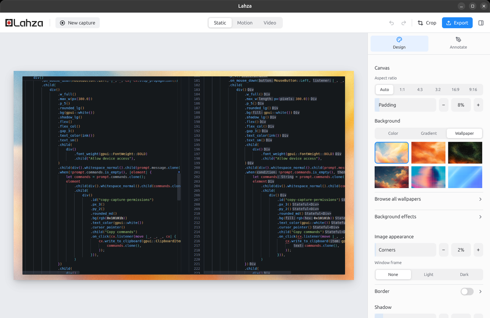
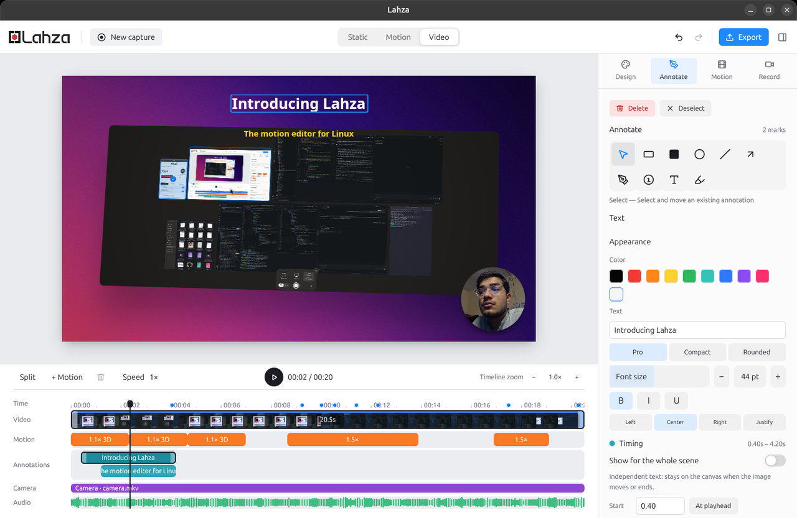
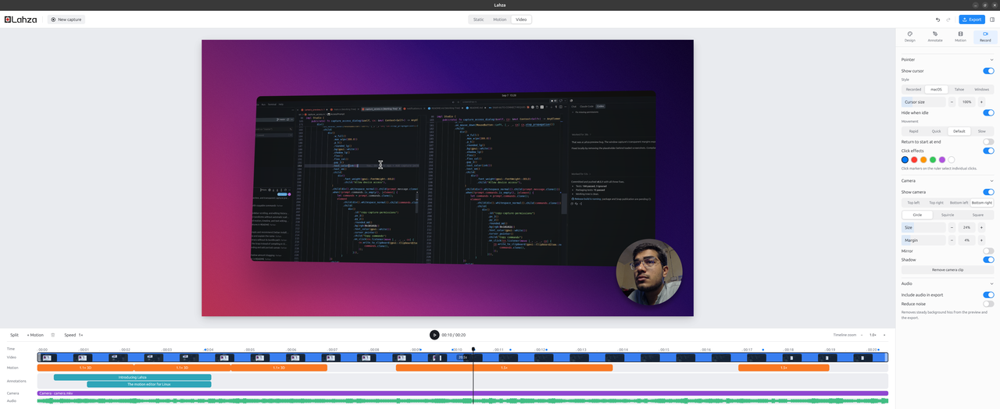
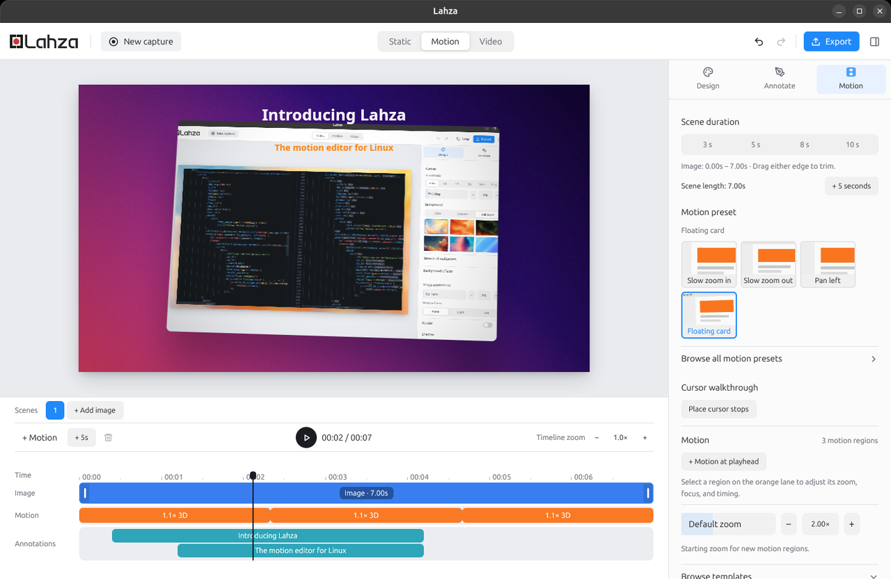
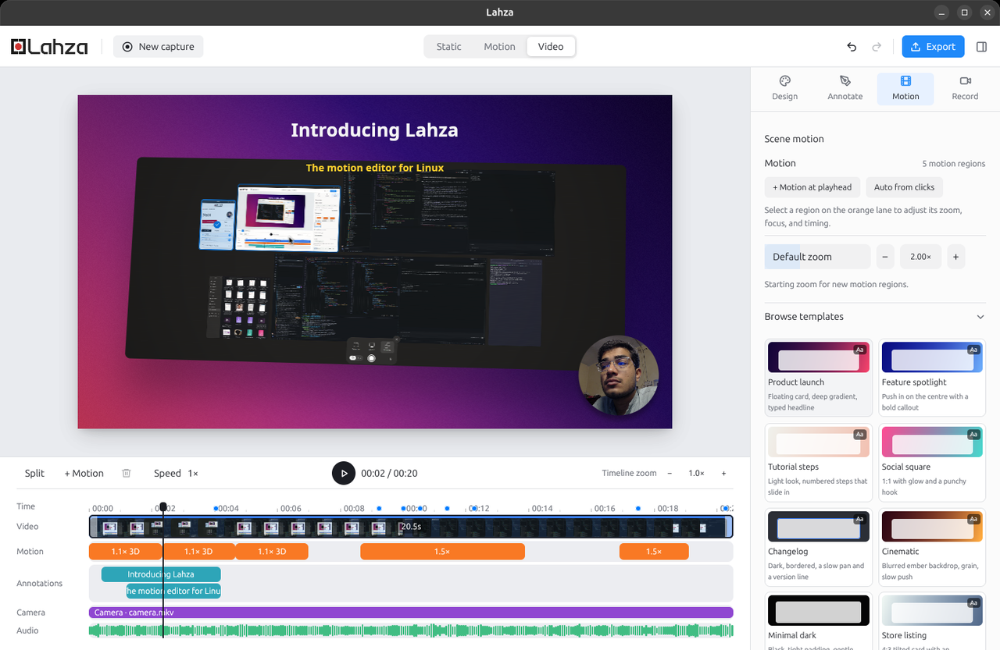
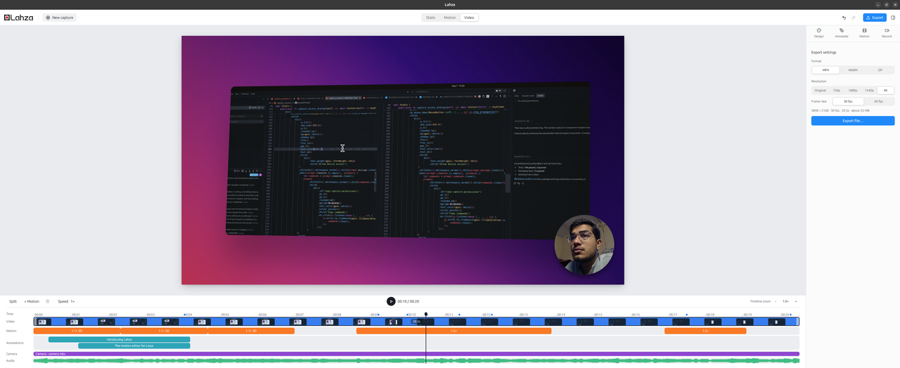

<div align="center">
  
  <h1>Lahza · لحظہ</h1>
  <p><em>Lahza</em> is Urdu for "a brief moment".</p>
  <p>A native Linux studio for screenshots, screen recordings, and motion.</p>
  <p>Capture a moment. Annotate it, style it, and turn it into something worth sharing.</p>
  <p><a href="#install">Install</a> · <a href="https://github.com/FarhanAliRaza/lahza/releases">All downloads</a> · <a href="https://github.com/FarhanAliRaza/lahza/issues">Report a bug</a> · <a href="#build-from-source">Build from source</a></p>
</div>

Built with Rust and GPUI, Lahza brings screenshot annotation, native screen recording, timeline editing, and animated presentations into one Linux desktop application.

## Install

### Debian / Ubuntu

Download the `.deb` for Ubuntu 24.04 amd64 from [GitHub Releases](https://github.com/FarhanAliRaza/lahza/releases), then run:

```bash
sudo apt install ./lahza_0.5.4_amd64.deb
```

### Snap

```bash
sudo snap install lahza
```

[Permissions, updates, and troubleshooting](#installation-details)

## Features

### Capture and record

Capture screens, windows, or areas. Record with system and microphone audio, pause and resume, and save editable projects with autosave.

### Design the scene

[](packaging/store/screenshots/01-screenshot-styling.png)

Style your captures with backgrounds, rounded corners, shadows, and window frames. Add effects and watermarks, adjust 3D perspective, and save reusable presets.

### Annotate screenshots and videos



Add arrows, shapes, text, numbered steps, and highlights. Blur sensitive details, crop screenshots, and animate annotations with custom timing.

### Edit recordings

[](packaging/store/screenshots/03-video-and-camera.png)

Trim, split, and change clip speed. Add zooms, pans, 3D motion, and camera overlays. Customize cursor effects and generate click-based zooms when input metadata is available.

### Animate still images

[](packaging/store/screenshots/02-motion-and-captions.png)

Turn screenshots into animated scenes with zoom, pan, and 3D presets. Combine images, timed captions, and cursor walkthroughs.

### Start from a template



Start with ready-made layouts for product launches, tutorials, social posts, changelogs, and more. Customize their styling, motion, and captions.

### Export

[](packaging/store/screenshots/04-export-formats.png)

Save screenshots as **PNG** and videos or animations as **MP4**, **WebM**, or **GIF**. Export up to **4K** at **30 or 60 fps**, with size estimates and progress tracking.

## Quick start

1. Launch Lahza and choose **Screenshot** or **Record screen**.
2. Use **Design** to style the scene and **Annotate** to add marks.
3. Select **Motion** for zooms, pans, transforms, or screenshot animation. Add a motion region at the playhead or double-click the orange lane, then select it to edit its focus and timing.
4. Use **Export** to choose an output format and save the result.

To record part of a screen, choose **Selected area** in the capture launcher,
then **Record area**. Choose the screen in the system picker, drag a rectangle
on its preview, and click **Start recording** (or press Enter). Use **Size** for
an exact 720p, 1080p, 1440p, or 4K capture, or **Shape** to draw in 16:9, 9:16,
1:1, or 4:3. Each shape starts at the largest size that fits the screen, so
switching shapes does not progressively shrink the selection. Sizes larger
than the selected screen are disabled. Drag inside
the selection to move it; in Free or a shape mode, Shift-drag draws a new area.
The displayed dimensions are capture pixels, independent of desktop scaling.
Escape or **Cancel** exits without starting a recording. Only the selected rectangle is
encoded, including when you pause and resume. Area recordings include the
system cursor; editable cursor effects and automatic click zooms are unavailable
in this mode.

While an area recording is active, a click-through red border marks its desktop
bounds. The border turns amber when paused and disappears when recording ends.
It uses X11/XWayland and is drawn outside the capture so it does not appear in
the saved video. Edges flush with a monitor boundary may be off-screen.

With the media selected, drag to move, **Shift-drag** to tilt, **Ctrl-drag** to spin, scroll to scale, and double-click to reset.

## Build from source

Install a Rust toolchain with Cargo and the native dependencies. On Ubuntu:

```bash
sudo apt update
sudo apt install -y build-essential pkg-config libclang-dev \
  libgstreamer1.0-dev libgstreamer-plugins-base1.0-dev \
  libpipewire-0.3-dev libspa-0.2-dev \
  libxkbcommon-dev libxkbcommon-x11-dev \
  ffmpeg gstreamer1.0-tools gstreamer1.0-libav gstreamer1.0-pipewire \
  gstreamer1.0-plugins-base-apps gstreamer1.0-plugins-good \
  gstreamer1.0-plugins-bad xdg-desktop-portal desktop-file-utils

git clone https://github.com/FarhanAliRaza/lahza.git
cd lahza
cargo build --release --locked
```

For a desktop install, use `just install-desktop` if you have [just](https://github.com/casey/just), or run:

```bash
install -Dm755 target/release/lahza ~/.local/bin/lahza
install -Dm644 packaging/com.lahza.Lahza.desktop \
  ~/.local/share/applications/com.lahza.Lahza.desktop
install -Dm644 assets/Lahza.png \
  ~/.local/share/icons/hicolor/512x512/apps/com.lahza.Lahza.png
update-desktop-database ~/.local/share/applications
gtk-update-icon-cache -t ~/.local/share/icons/hicolor
```

Ensure `~/.local/bin` is on `PATH`. After later changes, `just install` rebuilds and replaces the installed executable, stopping any running instance; `just run` also launches it. For development without installing, use `cargo run`.

### Optional GNOME input helper

The bundled GNOME Shell extension supplies additional pointer/click metadata and modifier/special-key captions. Install it with:

```bash
gnome-extensions pack --force --out-dir /tmp packaging/gnome-shell-extension
gnome-extensions install --force \
  /tmp/lahza-input@com.lahza.shell-extension.zip
gnome-extensions enable lahza-input@com.lahza
```

Log out and back in so GNOME Shell discovers the extension. It remains idle unless Lahza activates it through its runtime control file. Plain typed text is not logged. Without a successful helper connection, recording can fall back to an embedded cursor; editable pointer effects and automatic click zooms depend on available input metadata.

### Source layout

`src/main.rs` owns application startup, shared Studio state, and editor coordination. Editor behavior is split by responsibility:

- `models.rs`: annotation, crop, and timeline editing data types.
- `annotations.rs` and `crop.rs`: editing operations, geometry, painting, and related tests.
- `capture.rs`: recording lifecycle, project loading, and screenshot capture.
- `video.rs`: timeline editing and playback.
- `controls.rs`, `preview.rs`, and `launcher.rs`: editor controls, canvas layout, and launcher UI.
- `theme.rs`: shared colors, branding, and background presets.

The existing `recording/` modules own media processing and persistence. Keep new editor features in the module that owns their behavior; use explicit imports and limit helper visibility to the callers that need it.

### Development checks

```bash
cargo check --locked
cargo test --release --locked
```

Export integration tests require FFmpeg/FFprobe. Desktop capture and playback also need manual testing in a real Linux desktop session.

## First-release scope

Lahza is an early Linux release. Desktop portal behavior varies by compositor, and the presence of both display backends does not imply every capture feature has been validated on every desktop. Camera-file overlays are supported; live webcam capture and device selection remain unfinished. Recovery can salvage usable recordings, but cannot guarantee recovery after every encoder or system failure.

See [the engineering parity checklist](docs/VIDEO_PARITY.md) for deeper implementation notes and outstanding work. Some checklist entries track broader parity requirements, rather than whether an individual control exists.

## Contributing and reporting issues

Bug reports and focused pull requests are welcome. Include your distribution, desktop environment, Wayland/X11 session, Lahza version, steps to reproduce, and relevant terminal output. Review screenshots, recordings, and logs for private information before attaching them.

The application declares the **MIT** license in `Cargo.toml`.

## Installation details

Launch **Lahza** from your application menu. For the Debian package, you can also run `lahza`.

### Debian updates and troubleshooting

Debian packages built from this source include a terminal updater:

```bash
lahza-update --check
lahza-update --install
```

It checks the latest stable GitHub Release, downloads a newer package for your architecture, verifies its release SHA256 checksum and package metadata, and runs `sudo apt install`. APT asks for confirmation. Save your work and fully quit and reopen Lahza after installation. Checksums verify download integrity against the release; they are not independent signatures. The updater requires internet access and manages Debian installations only.

Existing 0.4.1 packages do not contain this command. Until you install a release containing it, you can run `python3 packaging/lahza-update --install` from this source checkout, or download a newer `.deb` and use `sudo apt install ./<downloaded-file>.deb`. Installing a local `.deb` does not subscribe APT to GitHub Releases; automatic updates through `apt upgrade` would require a separately hosted APT repository.

If the old app still opens, check for multiple installations:

```bash
type -a lahza
dpkg-query -W lahza
/usr/bin/lahza
```

A source or bundle install in `~/.local/bin/lahza` can take precedence over `/usr/bin/lahza`. A user launcher at `~/.local/share/applications/com.lahza.Lahza.desktop` also overrides the system launcher. Back up or remove those old local installation files if you want to use only the Debian package. New Debian package launchers explicitly select `/usr/bin/lahza`; an existing user launcher still takes precedence. New builds support `lahza --version` to identify the executable's version.

The `_apt` “unsandboxed as root” notice for an unreadable Downloads directory does not mean installation failed. The updater uses an APT-readable temporary download directory. Installing a package system-wide requires `sudo`; repeating the same version does not fetch a newer GitHub release.

For maintainers: update and commit the release notes on `master`, then run `just release` to bump the patch version and push a release tag. Pass a version such as `0.5.0` to choose it explicitly, or use `just release-check` to preview. See [release instructions](packaging/SNAP.md#cut-a-release). The release workflow validates the tag and publishes the `.deb` and `SHA256SUMS` consumed by the updater. Do not replace old release assets with changed builds under the same version.

Debian packages and binary bundles are built on **Ubuntu 24.04, amd64**. Compatibility with older distributions is not guaranteed; use the Snap or build from source if the package's dependencies are unavailable.

The release workflow also builds and tests a `core24` Snap. Matching version
tags publish it to the Snap Store after both package jobs pass (stable versions
to `stable`, prerelease versions to `beta`). Maintainers must first configure
the Store credential using the [Snap release setup](packaging/SNAP.md#github-actions-releases).

### Snap permissions and updates

The Snap requires [snapd](https://snapcraft.io/docs/installing-snapd) and extra camera and audio-recording permission setup. The Debian package uses normal desktop device access without these additional Snap connections.

Launch **Lahza** from your application menu, or run:

```bash
snap run lahza
```

The Snap bundles its desktop and media dependencies and receives automatic updates through snapd. To check for an update manually, close Lahza and run:

```bash
sudo snap refresh lahza
```

When camera or audio recording access is missing, Lahza shows an **Allow device
access** prompt with the commands needed to enable access. Choose **Copy commands**,
paste and run them in Terminal, then return and choose **Try again**. Device lists refresh
without restarting. See [Snap setup](packaging/SNAP.md) for troubleshooting.

To save files on removable drives, also run `sudo snap connect lahza:removable-media`.

**Previously installed a local test `.snap`?** Switch it to the Store version once to enable normal updates:

```bash
sudo snap refresh lahza --amend --channel=stable
```

Use `snap info lahza` to compare the installed version with the Store channels. If you also have a Debian or source installation, `snap run lahza` explicitly launches the Snap.

### Binary bundle — alternative

Each release also includes `lahza-0.5.4-linux-x86_64.tar.gz`, containing the executable, assets, and a user-local installer:

```bash
tar -xzf lahza-0.5.4-linux-x86_64.tar.gz
cd lahza-0.5.4-linux-x86_64
./install.sh
```

The installer adds the binary, assets, desktop entry, and icon under `~/.local`. Ensure `~/.local/bin` is on `PATH`. Run `./install.sh --help` for details. The bundle requires system libraries and is built on Ubuntu 24.04; it is not a static build. The release notes list runtime dependencies. `SHA256SUMS` accompanies both downloads for integrity verification.

### Desktop requirements

- A Linux desktop with Vulkan support. Wayland and X11 backends are compiled in.
- `xdg-desktop-portal` and the appropriate portal backend for your desktop.
- PipeWire for desktop capture. The Snap bundles GStreamer, FFmpeg, and FFprobe; Debian and source installations use system media libraries and tools.
- Desktop support for the screenshot and screencast portals. Picker options depend on your desktop.
