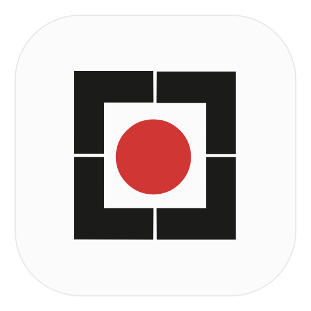

<div align="center">
  
  <h1>Lahza · لمحہ</h1>
  <p>A native Linux studio for screenshots, screen recordings, and motion.</p>
  <p>Capture a moment. Annotate it, style it, and turn it into something worth sharing.</p>
  <p><a href="https://github.com/FarhanAliRaza/lahza/releases">Downloads</a> · <a href="https://github.com/FarhanAliRaza/lahza/issues">Report a bug</a> · <a href="#build-from-source">Build from source</a></p>
</div>

Lahza means **moment** in Urdu. Built with Rust and GPUI, it brings screenshot annotation, native screen recording, timeline editing, and animated presentations into one Linux desktop application.

## Features

### Capture and record

- Capture a screen, window, or area through your desktop's screenshot picker.
- Use the **Screenshot** button in the launcher to capture a screen, window, or area.
- Record a monitor or window through the ScreenCast portal and PipeWire.
- Use a separate recorder window with pause, resume, restart, stop, and discard controls.
- Include system audio, microphone audio, or both.
- Keep recordings in editable `.lahzarec` project folders, with draft autosave and recovery of usable unfinished recordings.

### Annotate screenshots and videos

- Draw arrows, lines, freehand strokes, rectangles, filled rectangles, and ellipses.
- Add text, numbered steps, and highlights; obscure details with blur or pixelation.
- Crop screenshots and undo or redo edits.
- Give video and animated-image annotations start and end times on their own timeline lane.
- Animate annotations with effects such as draw-on, type-on, pop, and slide.

### Design the scene

- Frame your media with solid colors, gradients, or wallpaper backgrounds.
- Adjust padding, rounded corners, borders, shadows, and window frames.
- Add background blur, grain, vignette, and a corner text watermark.
- Position, scale, and rotate the media in 3D, with perspective and adjustable anchor points.
- Use **Fit**, **Fill**, and **Actual size**, or save a look to your personal preset library.

Perspective changes become visible when the media is tilted with Rotate X or Y. Anchor controls set the pivot for scaling and rotation.

### Edit recordings

- Preview recordings with synchronized audio and a seekable clip timeline.
- Trim, split, delete, and change clip speed, with undo/redo.
- Edit motion regions on the orange lane: timing, magnification, easing, focus, and pan destination.
- Generate zoom regions from captured clicks, then adjust them manually.
- Customize the reconstructed pointer, idle hiding, shadows, and click effects when input metadata is available.
- Composite an added camera clip as picture-in-picture, with shape, corner, size, mirroring, margin, and shadow controls.

### Animate still images

- Select **Motion** to turn a screenshot into an animated scene.
- Start with slow zooms, pans, center focus, sweep, 3D tilt, floating card, corner reveal, or tilted scroll presets.
- Edit the resulting motion regions using the same controls as recordings.
- Build a sequence of images, each with its own duration, motion, and captions.
- Create a synthetic cursor walkthrough by choosing points on the image.

For a loaded video, **Motion** opens the recording's motion controls directly.

### Start from a template

Choose **Product launch**, **Feature spotlight**, **Tutorial steps**, **Social square**, **Changelog**, **Cinematic**, **Minimal dark**, or **Store listing**. Templates combine scene styling, motion, and editable captions. On recordings, they add an intro while retaining later motion regions.

### Export

- Save styled screenshots as **PNG**.
- Export recordings and animated screenshots as **MP4 (H.264/AAC)**, **WebM (VP9/Opus)**, or **looping GIF**.
- Choose original resolution, 720p, 1080p, 1440p, or 4K, at 30 or 60 fps.
- See a size estimate, track progress, and cancel an export.
- Render backgrounds, media transforms, motion, pointers, and annotations through the scene compositor used by the preview.

## Install

### Debian / Ubuntu package

Download the `.deb` from [GitHub Releases](https://github.com/FarhanAliRaza/lahza/releases), then install the downloaded file:

```bash
sudo apt install ./lahza_0.2.0_amd64.deb
```

Launch **Lahza** from your application menu, or run `lahza`.

Release packages are built on **Ubuntu 24.04, amd64**. Compatibility with older distributions is not guaranteed; build from source if the package's dependencies are unavailable. Before the first release is published, development packages are available as artifacts in successful [build workflow runs](https://github.com/FarhanAliRaza/lahza/actions/workflows/linux-deb.yml).

### Binary bundle

Each release also includes `lahza-0.2.0-linux-x86_64.tar.gz`, containing the executable, assets, and a user-local installer:

```bash
tar -xzf lahza-0.2.0-linux-x86_64.tar.gz
cd lahza-0.2.0-linux-x86_64
./install.sh
```

The installer adds the binary, assets, desktop entry, and icon under `~/.local`. Ensure `~/.local/bin` is on `PATH`. Run `./install.sh --help` for details. The bundle requires system libraries and is built on Ubuntu 24.04; it is not a static build. The release notes list runtime dependencies. `SHA256SUMS` accompanies both downloads for integrity verification.

### Desktop requirements

- A Linux desktop with Vulkan support. Wayland and X11 backends are compiled in.
- `xdg-desktop-portal` and the appropriate portal backend for your desktop.
- PipeWire and GStreamer for recording; FFmpeg/FFprobe for preview and video export.
- Desktop support for the screenshot and screencast portals. Picker options depend on your desktop.


## Quick start

1. Launch Lahza and choose **Screenshot** or **Record screen**.
2. Use **Design** to style the scene and **Annotate** to add marks.
3. Select **Motion** for zooms, pans, transforms, or screenshot animation. Add a motion region at the playhead or double-click the orange lane, then select it to edit its focus and timing.
4. Use **Export** to choose an output format and save the result.

With the media selected, drag to move, **Shift-drag** to tilt, **Ctrl-drag** to spin, scroll to scale, and double-click to reset.

## Build from source

Install a Rust toolchain with Cargo and the native dependencies. On Ubuntu:

```bash
sudo apt update
sudo apt install -y build-essential pkg-config libclang-dev \
  libgstreamer1.0-dev libgstreamer-plugins-base1.0-dev \
  libpipewire-0.3-dev libspa-0.2-dev \
  libxkbcommon-dev libxkbcommon-x11-dev \
  ffmpeg gstreamer1.0-tools gstreamer1.0-libav gstreamer1.0-pipewire \
  gstreamer1.0-plugins-base-apps gstreamer1.0-plugins-good \
  gstreamer1.0-plugins-bad xdg-desktop-portal desktop-file-utils

git clone https://github.com/FarhanAliRaza/lahza.git
cd lahza
cargo build --release --locked
```

For a desktop install, use `just install-desktop` if you have [just](https://github.com/casey/just), or run:

```bash
install -Dm755 target/release/lahza ~/.local/bin/lahza
install -Dm644 packaging/com.lahza.Lahza.desktop \
  ~/.local/share/applications/com.lahza.Lahza.desktop
install -Dm644 Lahza.png \
  ~/.local/share/icons/hicolor/512x512/apps/com.lahza.Lahza.png
update-desktop-database ~/.local/share/applications
gtk-update-icon-cache -t ~/.local/share/icons/hicolor
```

Ensure `~/.local/bin` is on `PATH`. After later changes, `just install` rebuilds and replaces the installed executable, stopping any running instance; `just run` also launches it. For development without installing, use `cargo run`.

### Optional GNOME input helper

The bundled GNOME Shell extension supplies additional pointer/click metadata and modifier/special-key captions. Install it with:

```bash
gnome-extensions pack --force --out-dir /tmp packaging/gnome-shell-extension
gnome-extensions install --force \
  /tmp/lahza-input@com.lahza.shell-extension.zip
gnome-extensions enable lahza-input@com.lahza
```

Log out and back in so GNOME Shell discovers the extension. It remains idle unless Lahza activates it through its runtime control file. Plain typed text is not logged. Without a successful helper connection, recording can fall back to an embedded cursor; editable pointer effects and automatic click zooms depend on available input metadata.

### Source layout

`src/main.rs` owns application startup, shared Studio state, and editor coordination. Editor behavior is split by responsibility:

- `models.rs`: annotation, crop, and timeline editing data types.
- `annotations.rs` and `crop.rs`: editing operations, geometry, painting, and related tests.
- `capture.rs`: recording lifecycle, project loading, and screenshot capture.
- `video.rs`: timeline editing and playback.
- `controls.rs`, `preview.rs`, and `launcher.rs`: editor controls, canvas layout, and launcher UI.
- `theme.rs`: shared colors, branding, and background presets.

The existing `recording/` modules own media processing and persistence. Keep new editor features in the module that owns their behavior; use explicit imports and limit helper visibility to the callers that need it.

### Development checks

```bash
cargo check --locked
cargo test --release --locked
```

Export integration tests require FFmpeg/FFprobe. Desktop capture and playback also need manual testing in a real Linux desktop session.

## First-release scope

Lahza is an early Linux release. Desktop portal behavior varies by compositor, and the presence of both display backends does not imply every capture feature has been validated on every desktop. Camera-file overlays are supported; live webcam capture and device selection remain unfinished. Recovery can salvage usable recordings, but cannot guarantee recovery after every encoder or system failure.

See [the engineering parity checklist](docs/VIDEO_PARITY.md) for deeper implementation notes and outstanding work. Some checklist entries track broader parity requirements, rather than whether an individual control exists.

## Contributing and reporting issues

Bug reports and focused pull requests are welcome. Include your distribution, desktop environment, Wayland/X11 session, Lahza version, steps to reproduce, and relevant terminal output. Review screenshots, recordings, and logs for private information before attaching them.

The application declares the **MIT** license in `Cargo.toml`.
